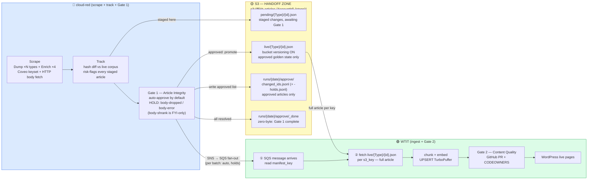

# cloud-red (P1) Pipeline — Master Reference

The single source of truth for the cloud-red serverless pipeline: what it does, how it
runs in AWS, the Gate 1 approval model, the P2 handoff, restore/manual operations, the
S3 schema, AWS resources, IAM, cost, deployment, and operations.

**Status:** Deployed and running in **staging**. Prod deploys the same template with
different parameters.
**Stacks:** `f5kb-staging` (live) · `f5kb-prod` (same template, deploy when ready)
**Region:** `us-east-2` · **Deploy:** AWS SAM (`sam deploy --config-env staging|prod`)
**IaC:** `template.yaml` in repo `worldtechit/f5kb-python`

Throughout, `{AccountId}` is the P1 AWS account id and `{stage}` is `staging` or `prod`.
Bucket: `f5kb-articles-{AccountId}-{stage}`.

---

## Table of Contents

1. [Overview](#1-overview)
2. [The Two Gates (core mental model)](#2-the-two-gates-core-mental-model)
3. [Architecture](#3-architecture)
4. [Run Cadence & Manual Invocation](#4-run-cadence--manual-invocation)
5. [Article Types — What We Process](#5-article-types--what-we-process)
6. [Full Pipeline Run — Step-by-Step](#6-full-pipeline-run--step-by-step)
7. [Article Envelope (S3 object shape)](#7-article-envelope-s3-object-shape)
8. [Lambda Timeout & Failure Recovery — Cursor State](#8-lambda-timeout--failure-recovery--cursor-state)
9. [Gate 1 — Approval Implementation](#9-gate-1--approval-implementation)
10. [Completion Marker Chain](#10-completion-marker-chain)
11. [P2 Handoff Contract (SNS → SQS)](#11-p2-handoff-contract-sns--sqs)
12. [Restore Process](#12-restore-process)
13. [Manual Operations Reference](#13-manual-operations-reference)
14. [S3 Schema — Layout, Files & Justification](#14-s3-schema--layout-files--justification)
15. [S3 Lifecycle Policy](#15-s3-lifecycle-policy)
16. [Logging Strategy](#16-logging-strategy)
17. [Pipeline Status & Observability](#17-pipeline-status--observability)
18. [Monitoring — Alarms & Watchdog](#18-monitoring--alarms--watchdog)
19. [AWS Resource Inventory](#19-aws-resource-inventory)
20. [Lambda Configuration](#20-lambda-configuration)
21. [IAM Permissions](#21-iam-permissions)
22. [Cost Estimate](#22-cost-estimate)
23. [Deployment](#23-deployment)
24. [Rollback Plan](#24-rollback-plan)
25. [Team Ownership](#25-team-ownership)
26. [Key Design Decisions — Summary](#26-key-design-decisions--summary)
27. [Environment Differences & Remaining Handshake Items](#27-environment-differences--remaining-handshake-items)

---

## 1. Overview

**What is P1 (cloud-red)?**
P1 is the cloud-red pipeline. Its job is simple: check F5's knowledge base every day,
find what changed, verify it's safe, and hand the approved changes to the WTIT team (P2)
for ingestion into the AI system.

P1 never publishes anything publicly. It only moves data from F5 → S3 → P2.

**The one-sentence version:**

> Every day at 2am: scrape F5, find what changed, check nothing was accidentally deleted, approve it, tell P2.

This is a fully serverless pipeline that scrapes the F5 Knowledge Base (~106,000
articles) via Coveo's guest-token API, maintains a versioned article store in S3
(bucket versioning ON), and hands off approved changes to the WTIT ingest pipeline via
SNS → SQS fan-out. **No EC2, no RDS, no VPC.** All compute is Lambda; all state is S3.

The pipeline runs automatically (EventBridge Scheduler, daily). Lambda timeout recovery
via S3 cursor state, SQS retry/DLQ on both work queues, per-run Slack dedup, four
CloudWatch alarms, and a daily watchdog Lambda make it observable and self-recovering.
Held articles are auto-escalated (approved) after 24h so a missed Slack message can
never permanently block P2 or the next day's run.

---

## 2. The Two Gates (core mental model)

```
┌─────────────────────────────────────────────────────────────────────┐
│  GATE 1 — Article Integrity (cloud-red owns this)                   │
│                                                                     │
│  DEFAULT: ALL changes are AUTO-APPROVED.                            │
│  Exceptions held for human review:                                  │
│    body-dropped · body-error  (body-shrank is FYI-only)             │
│  ~99% of runs need zero human interaction.                          │
│                                                                     │
│  Approved → article goes to live/, P2 gets it, TurboPuffer updated  │
│  Rejected → live/ unchanged, P2 never sees it, old content stays    │
└─────────────────────────────────────────────────────────────────────┘

         ↓ only approved articles flow downstream ↓

┌─────────────────────────────────────────────────────────────────────┐
│  GATE 2 — Content Quality (wtit / GitHub PR gate)                   │
│                                                                     │
│  Question: "Is the AI-generated draft accurate and                  │
│             good enough to publish to worldtechit.com?"             │
│                                                                     │
│  Approve → squash-merge → GitHub Actions → WordPress live           │
│  Reject  → PR closed, nothing published, logged                     │
└─────────────────────────────────────────────────────────────────────┘
```

**Critical:** the SNS message to the handoff topic (`f5kb-handoff-{stage}`), and the
per-run manifest it points to, is sent ONLY for approved articles. P2 never sees a
rejected article. P2 never sees a pending article. The monthly files under `audit/`
are audit logs — the SNS message is the actual P2 trigger.

---

## 3. Architecture

### Service Boundary Diagram

Who owns what, where each gate lives, and how downstream teams consume approved content.



### Full Pipeline Diagram

The complete AWS resource flow from the EventBridge trigger through both gates.

```mermaid
flowchart TD
    EB([EventBridge Scheduler\ndaily 02:00 UTC]) --> ORCH

    subgraph P1DUMP ["P1 — ORCHESTRATE + DUMP"]
        ORCH["Orchestrator Lambda\nstep-zero sweep of prior runs\nconditional status.json (no double-start)\nwrites lambda/state/date/orchestrator.json"]
        ORCH -->|"SQS: 1 msg per type"| DUMP["Dump Lambda (per type, parallel)\n@rowid keyset pagination\nskip-unchanged via hash index\nstages pending/ + appends per-type manifest"]
        DUMP -->|"timeout or page failure"| CURSOR["Save @rowid cursor\nlambda/state/date/dump-Type.json\nre-queue self via SQS"]
        CURSOR -->|next invocation| DUMP
        DUMP -->|type finished| DONE_DUMP_T["runs/date/dump/Type/_done"]
    end

    subgraph P1ENRICH ["P1 — ENRICH (4 enrichable types)"]
        DONE_DUMP_T -->|"EventBridge rule\n(enrichable types only)"| ENRQ["EnrichQueue (SQS)\nretry + DLQ + cursor parity"]
        ENRQ --> ENRICH["Enrich Lambda\nHTTP fetch → body_text\nreads per-type manifest\ncursor + re-queue on timeout"]
        ENRICH --> DONE_ENR_T["runs/date/enrich/Type/_done"]
    end

    DONE_DUMP_T -->|"non-enrichable:\nterminal gate check"| SCRAPE_DONE
    DONE_ENR_T -->|"enrichable:\nterminal gate check"| SCRAPE_DONE["runs/date/scrape/_done\nconditional PUT — last finisher wins"]

    subgraph P1TRACK ["P1 — TRACK"]
        SCRAPE_DONE -->|EventBridge rule| TRACK["Track Lambda\nhash diff vs hash-index + live/\nrisk-flags each staged article\nwrites track/changes.jsonl + summary.json\nself-reinvokes near timeout"]
        TRACK --> DONE_TRACK["runs/date/track/_done"]
    end

    subgraph GATE1 ["🔵 GATE 1 — auto-approve EXCEPT body-dropped / body-error"]
        DONE_TRACK -->|EventBridge rule| APRLAMBDA["Approve Lambda (concurrency 1)\nidempotency: approve/started.json\nreads per-type manifests + track risk index"]
        APRLAMBDA -->|"no hold flags"| AUTO["Auto-promote\narchive live → pending → live\nappend changed_ids.jsonl"]
        AUTO --> SNSAUTO["SNS publish batch=auto\n(IMMEDIATELY — holds never delay it)"]
        APRLAMBDA -->|"hold flags"| HOLD["Hold in pending/\nSlack message + buttons\nlambda/state/date/approve_held.json"]
        HOLD --> HUMAN["Human via Slack / console\n(or 24h watchdog auto-escalation)"]
        HUMAN -->|approve| PROMOTE["Promote + append\nchanged_ids-holds.jsonl"]
        HUMAN -->|reject| REJ["Delete pending/\nlive/ unchanged"]
        PROMOTE -->|last hold resolved| SNSHOLDS["SNS publish batch=holds"]
    end

    SNSAUTO --> SNS["f5kb-handoff-{stage}\n(SNS topic)"]
    SNSHOLDS --> SNS
    SNS -->|"raw delivery"| P2Q["Consumer SQS queue\n(lives in WTIT's account/stack)"]
    SNS -.->|"subscribe any SQS\nno P1 code change"| OTHERQ["any future consumer"]

    SLACK([Slack button click]) --> APIGW["HTTP API /slack"]
    APIGW --> ACK["SlackAck Lambda\nHMAC signature verify\nack ≤ 3s"]
    ACK -->|async invoke| APRLAMBDA

    subgraph P2 ["🟢 P2 — INGEST (wtit)"]
        P2Q --> PULL["read manifest → fetch live/ keys\nchunk + embed → TurboPuffer"]
    end

    style P1DUMP fill:#e8f4fd,stroke:#2196F3
    style P1ENRICH fill:#e8f4fd,stroke:#2196F3
    style P1TRACK fill:#e8f4fd,stroke:#2196F3
    style GATE1 fill:#dbeafe,stroke:#1d4ed8,stroke-width:2px
    style P2 fill:#dcfce7,stroke:#16a34a
```



### Daily Run — Full Sequence

```mermaid
sequenceDiagram
    participant EB as EventBridge<br/>(02:00 UTC daily)
    participant ORCH as Orchestrator
    participant DMP as Dump ×N<br/>(via DumpQueue)
    participant ENR as Enrich ×4<br/>(via EnrichQueue)
    participant TRK as Track
    participant APR as Approve
    participant COV as Coveo API
    participant S3 as S3 Bucket
    participant HUM as Human<br/>(Slack, rare)
    participant P2 as WTIT consumer

    EB->>ORCH: trigger daily run
    ORCH->>S3: sweep prior runs (escalate/resume/mark-failed)
    ORCH->>S3: conditional PUT runs/{date}/status.json (double-start guard)
    ORCH->>S3: write lambda/state/{date}/orchestrator.json
    ORCH->>DMP: SQS — one message per type

    loop per type (parallel)
        DMP->>S3: read lambda/config/types.json + hash-index
        DMP->>COV: @rowid keyset pages
        COV-->>DMP: article batches
        DMP->>DMP: hash metadata, compare to index
        alt unchanged
            DMP->>DMP: skip (no write)
        else new or changed
            DMP->>S3: write pending/{Type}/{id}.json
            DMP->>S3: append runs/{date}/manifest/{Type}.jsonl
        end
        DMP->>S3: dump/{Type}/_index.json + _done
    end

    Note over DMP,ENR: dump/{Type}/_done for the 4 enrichable types<br/>routes via EventBridge → EnrichQueue
    ENR->>S3: read manifest, fetch bodies via HTTP, update pending/
    ENR->>S3: enrich/{Type}/_report.json + _done

    Note over DMP,ENR: LAST finisher (dump or enrich) wins the<br/>conditional PUT of runs/{date}/scrape/_done

    S3->>TRK: EventBridge on scrape/_done
    TRK->>S3: diff pending vs live + hash index, risk-flag
    TRK->>S3: track/changes.jsonl + summary.json + _done

    S3->>APR: EventBridge on track/_done
    APR->>S3: idempotency guard (started.json / _done)
    loop per staged article
        alt no hold flags
            APR->>S3: archive live → promote pending → live
            APR->>S3: append approve/changed_ids.jsonl
        else body-dropped / body-error
            APR->>S3: record in lambda/state/{date}/approve_held.json
        end
    end
    APR->>S3: save hash-index, write audit/{month}/ trails
    APR->>P2: SNS batch=auto (immediately — holds never delay it)
    APR->>HUM: ONE Slack message (two-phase dedup)

    opt holds exist
        HUM->>APR: approve / reject (via SlackAck → async invoke)
        APR->>S3: promote or drop; append changed_ids-holds.jsonl
        APR->>P2: SNS batch=holds (after the LAST hold resolves)
    end
    APR->>S3: approve/_done + status.json phase=done
    P2->>S3: read manifest_key → fetch live/ articles → ingest
```

---

## 4. Run Cadence & Manual Invocation

Two run modes. The Orchestrator determines the mode from the day of week at invocation
time; pass an explicit `mode` in the payload to override.

| Schedule | Mode | What it fetches | Typical duration |
|---|---|---|---|
| Mon–Sat 02:00 UTC | `incremental` — 48h `@date` window | Only articles whose metadata changed in the last 48h (~1–5% of corpus). | ~5–15 min |
| Sunday 02:00 UTC | `full` — `@rowid` keyset, entire corpus | Every article regardless of date. Catches null-`@date` docs, bulk re-indexes. | ~45–90 min scrape; the FIRST full run also body-fetches every enrichable article (Manual ~47k, Bug_Tracker ~22k) and takes hours |

Both schedules (daily cron and the 06:00 watchdog) follow the `ScheduleState`
CloudFormation parameter: **ENABLED in prod, DISABLED in staging** — staging runs are
manual.

**WHY 02:00 UTC?** Off-peak for both US and UK — minimises overlap with F5 maintenance
windows and WTIT business hours.

### Manual invocation

```bash
# Incremental (metadata scan, same as the Mon–Sat schedule)
aws lambda invoke --function-name f5kb-orchestrator-{stage} --region us-east-2 \
  --payload '{"mode":"incremental"}' --cli-binary-format raw-in-base64-out r.json && cat r.json

# Full (entire corpus, same as the Sunday schedule)
aws lambda invoke --function-name f5kb-orchestrator-{stage} --region us-east-2 \
  --payload '{"mode":"full"}' --cli-binary-format raw-in-base64-out r.json && cat r.json

# Auto (day-of-week logic, same as the cron)
aws lambda invoke --function-name f5kb-orchestrator-{stage} --region us-east-2 \
  --payload '{}' --cli-binary-format raw-in-base64-out r.json && cat r.json

# Sweep only (close out prior runs without starting a new one)
aws lambda invoke --function-name f5kb-orchestrator-{stage} --region us-east-2 \
  --payload '{"action":"sweep_only"}' --cli-binary-format raw-in-base64-out r.json && cat r.json
```

A duplicate invocation for the same date returns `{"started": false, "reason":
"already_started"}` — the conditional PUT of `runs/{date}/status.json` guarantees a run
can only start once per day.

The web console (`ui/`, run with `--allow-writes`) exposes the same triggers with
confirmation dialogs.

---

## 5. Article Types — What We Process

15 article types exist in Coveo. **13 are processed in prod. 2 are permanently excluded.**
Staging processes a small subset (see §27).

| Type key | Coveo `documentType` | Processed | Notes |
|---|---|---|---|
| Support_Solution | Support Solution | ✅ | Largest type |
| Known_Issue | Known Issue | ✅ | |
| Knowledge | Knowledge | ✅ | |
| Security_Advisory | Security Advisory | ✅ | |
| Video | Video | ✅ | |
| Policy | Policy | ✅ | |
| Operations_Guide | Operations Guide | ✅ | |
| Compliance | Compliance | ✅ | |
| Education | Education | ✅ | |
| Manual | Manual | ✅ | Enrichable — body fetched via HTTP (~47k articles) |
| Release_Note | Release Note | ✅ | Enrichable (~800 articles) |
| Supplemental_Document | Supplemental Document | ✅ | Enrichable (~150 articles) |
| Bug_Tracker | Bug Tracker | ✅ | Enrichable (~22k articles) |
| **Community** | Community | ❌ | Khoros/Lithium forum posts — millions of low-signal user posts. Noise. |
| **F5_GitHub** | F5 GitHub | ❌ | Repo content, mostly code. Enricher exists but the type is not in any run. |

**Enrichable types** (body text not in the Coveo index, fetched via HTTP): Manual,
Release_Note, Supplemental_Document, Bug_Tracker.

### How the type list and field config are resolved

The Orchestrator resolves the run's type list from, in priority order:

1. `TYPE_KEYS` env var — comma-separated, set via the `TypeKeys` CloudFormation parameter
2. `lambda/config/types.json` in S3 — the mapping's keys
3. **Neither present → the run FAILS HARD** (RuntimeError). There is no silent fallback.

Separately, the Dump Lambda reads `lambda/config/types.json` for each type's
**field configuration**: the exact Coveo `documentType` filter value (spaces, not
underscores — `"Support Solution"`, not `"Support_Solution"`) and the metadata/content
field keep-lists. Without this file, multi-word types match zero Coveo results and the
metadata/content split falls back to everything-in-metadata.

**Required after every deploy and every `config.yaml` change:**

```bash
make sync-config BUCKET=f5kb-articles-{AccountId}-{stage}
# uploads config.yaml's types: block to s3://…/lambda/config/types.json
```

---

## 6. Full Pipeline Run — Step-by-Step

### ⏰ STEP 0 — Schedule fires

- EventBridge Scheduler triggers at **02:00 UTC daily** (cron `0 2 * * ? *`, UTC),
  when `ScheduleState=ENABLED`. Manual triggers any time (§4).

### 🎯 STEP 1 — Orchestrator Lambda

- Routes on the payload: `sweep_only` / `auto_escalate` / normal run.
- Resolves the type list (§5) — fails hard if unresolvable.
- **Step-zero sweep (blocking):** walks every prior `runs/` date that never reached
  `approve/_done`:
  - prior run has unresolved holds → invokes Approve with `auto_escalate`, polls up to
    5 min for closure; if it cannot close, alerts ops and **aborts today's run**
  - prior run tracked but never approved → invokes Approve with `resume`
  - prior run died mid-scrape → marks its `status.json` `phase=failed`, alerts ops,
    today's run supersedes it
- **Double-start guard:** conditional PUT (If-None-Match) of `runs/{date}/status.json`.
  A duplicate cron delivery loses the PUT and exits without fanning out.
- Writes the run manifest `lambda/state/{date}/orchestrator.json` — mode, type list,
  enrichable subset. Downstream Lambdas and the terminal gate read this.
- Sends **one SQS message per type** to the Dump queue:
  `{run_date, type_key, mode, hash_index_key, enrichable}`.

**WHY SQS fan-out instead of one Lambda doing all types?** Each type can have tens of
thousands of articles and one Lambda has a 15-minute hard limit. One message per type
means the Dump Lambdas run in parallel — the scrape finishes in the time of the slowest
single type.

### 📥 STEP 2 — Dump Lambda (one per type, parallel)

- Reads its type from the SQS message; loads the per-type field config from
  `lambda/config/types.json` and the **hash index** (`hash-index/current.json.gz`).
- Loads a saved cursor if a prior invocation timed out mid-type.
- Queries Coveo with `@f5_document_type=="<documentType>"`:
  - incremental mode adds a 48h `@date` window
  - pages via `@rowid` keyset (`@rowid>{cursor}`, sorted ascending)
- For each article: flatten fields → split into metadata/content per config → hash the
  metadata → compare to the hash index:
  - **unchanged → skip** (no write, no manifest entry)
  - **new / changed → write `pending/{Type}/{id}.json`** and append one line to the
    per-type manifest `runs/{date}/manifest/{Type}.jsonl`
- Before each page, checks remaining time; **< 60s → save cursor, re-queue self, exit.**
- A **page-fetch failure** saves the cursor and re-queues itself with a short backoff
  (attempt counter in the message); after 3 consecutive no-progress attempts it raises
  and the SQS redrive delivers the message to the DLQ (§8).
- On completion: writes `dump/{Type}/_index.json` (counts) + `dump/{Type}/_done`.
- **Non-enrichable types then run the terminal-gate check** (§10). Enrichable types stop
  here — Enrich owns their terminal marker.

**WHY `pending/` instead of writing directly to `live/`?** Safety gate. Live approved
content is never overwritten until Gate 1 confirms the new version is safe. An F5 page
accidentally returning empty content must not silently replace a good article.

**WHY `@rowid` keyset pagination?** Coveo rejects any request where
`firstResult + numberOfResults > 5000`. Offset paging silently stops at 5,000 articles.
Keyset pagination has no offset — the full corpus is reachable.

### 🔍 STEP 3 — Enrich Lambda (4 enrichable types)

- `dump/{Type}/_done` for an enrichable type matches an EventBridge rule that targets
  **EnrichQueue (SQS)** — the queue provides retry, DLQ, and timeout-recovery parity
  with Dump. (Two message shapes: the EventBridge envelope, and the Lambda's own
  re-queue cursor message.)
- Reads the per-type manifest and, for every staged article that doesn't already have a
  body: fetches the article's `link` over HTTP and writes the extracted `body_text`
  (and `sections`) into the pending envelope. Fetch failures record a `bodyError`
  instead of a body — both counted as failed in the report.
- Checkpoints its cursor every 50 articles; re-queues itself when < 60s remain.
- On completion: writes `enrich/{Type}/_report.json` (`{enriched, failed, skipped,
  total}`) + `enrich/{Type}/_done`, then runs the terminal-gate check.

**WHY HTTP fetch instead of Coveo?** Coveo's index for these types is metadata-only —
the body is served by F5's CDN / TechDocs sites. No headless browser is needed; every
page embeds its content server-side.

### 📊 STEP 4 — Track Lambda

- Triggered by `runs/{date}/scrape/_done` (the terminal gate — see §10).
- Reads every per-type manifest; for each staged article compares against its `live/`
  version and the hash index:
  - `op`: `new` (no prior hash) / `changed` / `unchanged`
  - risk flags: see the table in §9
- Streams one record per article into `runs/{date}/track/changes.jsonl`.
- Processes types one at a time; saves `track/progress.json` after each and
  **async-invokes itself** when < 60s remain (resume support).
- On completion: `track/summary.json` (counts + risk breakdown), conditional PUT of
  `track/_done`, advances `status.json` to `phase=approve`.

**WHY risk flags?** The most dangerous failure is F5 quietly returning empty content —
a CDN glitch or soft-404. Without this check the empty page would silently replace a
good article in `live/`.

### ✅ STEP 5 — Approve Lambda (Gate 1)

The **only step where articles enter `live/`**. Reserved concurrency 1 serializes
EventBridge triggers, Slack clicks, console actions, sweeps, and self-reinvokes.

- Triggered by `runs/{date}/track/_done`.
- **Idempotency guard first** (§9): `_done` → exit; `started.json` → resume;
  else conditional-PUT `started.json`.
- Reads the per-type manifests + the risk index from `track/changes.jsonl`.
- Per article: hold flags (`body-dropped`, `body-error`) → held;
  otherwise archive current live → promote pending → live → append to
  `runs/{date}/approve/changed_ids.jsonl`.
- **SPLIT PUBLISH:** as soon as the auto pass completes, the hash index is saved, the
  audit trails written, and **SNS `batch=auto` is published immediately** — holds never
  delay the clean 99%.
- One Slack message per run (two-phase dedup, §9), listing held articles with buttons.
- Holds are persisted to `lambda/state/{date}/approve_held.json`. When the **last** hold
  resolves (human, console, or escalation): approved holds are published as SNS
  `batch=holds`, then `approve/_done` is written and `status.json` becomes `phase=done`.
- No holds at all → `approve/_done` immediately (fully automated run).

**WHY archive before overwrite?** Every overwrite is reversible via the Restore Lambda
— but only if the displaced version was archived first. Bucket versioning is the
automatic backstop; `archive/` is the structured, timestamped restore path.

**WHY update the hash index only for approved articles?** If a rejected article's hash
entered the index, the next run would see it as "unchanged" and never re-check it.

### 🔄 STEP 5b — Human review via Slack (rare)

- The Slack message's buttons POST to the **HTTP API → SlackAck Lambda**, which verifies
  the Slack signing signature (`v0:{ts}:{body}` HMAC, 5-min replay window), ACKs within
  3 seconds, and **async-invokes Approve** with the decision. SlackAck has no
  concurrency cap so it always answers while Approve (concurrency 1) is busy.
- Approve resolves the hold: approve → archive live, promote, append to
  `changed_ids-holds.jsonl`; reject → delete pending, live unchanged, audit only.
- The web console's Review page drives the identical actions (single, selected, or all).

### 📤 STEP 6 — P2 handoff

- SNS `f5kb-handoff-{stage}` fans each batch message out to every subscribed SQS queue.
  The consumer queue lives in **WTIT's account/stack** — P1 owns only the topic.
- Message: `{schema, run_date, mode, batch, article_count, manifest_key, bucket,
  published_at}` (§11).
- Consumer: `article_count == 0` → done; else read the manifest, GET each `s3_key`
  from `live/`, upsert. **P1's job ends at the SNS publish.**

---

## 7. Article Envelope (S3 object shape)

Written to `pending/{Type}/{id}.json` during dump, enriched in place, promoted to
`live/{Type}/{id}.json` on approval. Schema owned by cloud-red.

```json
{
  "run_date":      "2026-07-08",
  "captured_at":   "2026-07-08T02:34:56Z",
  "type_key":      "Policy",
  "id":            "K000130410",
  "documentType":  "Policy",
  "title":         "K000130410: Example article title",
  "link":          "https://my.f5.com/manage/s/article/K000130410",
  "metadata_hash": "44a1f0c2…",
  "content_hash":  "9c2fe1ab…",
  "metadata": {
    "f5_kb_id": "K000130410",
    "f5_title": "Example article title",
    "f5_product": ["BIG-IP"],
    "f5_updated_published_date": "…",
    "…": "curated per-type field keep-list from config.yaml"
  },
  "content": {
    "body_text": "…plain text (enriched types)…",
    "sections": {"Symptoms": "…"},
    "bodySource": "https://…",
    "fetchedAt": "2026-07-08T02:40:00Z"
  }
}
```

- `type_key` is the underscored key; `documentType` is Coveo's exact filter value.
- `title` and `link` are always top-level — the enrichers require `link`.
- `content` varies by type: the 8 Salesforce types carry `sfdetails__c` (HTML) straight
  from the index; Education carries `zendeskdescription`; the 4 enrichable types gain
  `body_text` / `sections` / `bodySource` / `fetchedAt` from the Enrich Lambda. A failed
  fetch records `bodyError` instead of a body.
- Hashes are plain sha256 hex. For change detection, volatile fetch bookkeeping
  (`bodySource`, `fetchedAt`) is excluded — a re-fetch of unchanged content is not a
  "change".

---

## 8. Lambda Timeout & Failure Recovery — Cursor State

Large types (Manual ~47k articles, Bug_Tracker ~22k) exceed Lambda's 15-minute limit.
Dump and Enrich save a cursor and re-queue themselves; the next invocation resumes
exactly where the last one stopped.

```json
// lambda/state/{date}/dump-{Type}.json
{
  "run_date":     "2026-07-08",
  "type_key":     "Manual",
  "rowid_cursor": 1847392819204715,
  "written":      43217,
  "count_server": 46811,
  "status":       "in_progress",
  "last_updated": "2026-07-08T02:23:45Z"
}
```

Per Dump invocation:

1. Load cursor from S3 if present (else start from the beginning).
2. Page Coveo via `@rowid > cursor`; stage articles; append manifest lines.
3. Before each page: check remaining time. **< 60s → save cursor → re-queue self →
   return cleanly.**
4. `count_server` (the progress denominator) is captured **only on a fresh start** — a
   resumed invocation's first page is already filtered past the cursor, so its total
   only covers the remainder.
5. A **page-fetch failure** saves the cursor and re-queues with an `attempt` counter and
   a 1–4 min delay. Progress in an invocation resets the streak; **3 consecutive
   no-progress failures → raise → SQS redrive (maxReceiveCount 3) → DLQ + alarm.**
6. A short page (fewer results than the page size) ends the type: `_index.json`,
   `_done`, cursor deleted.

The Enrich cursor (`lambda/state/{date}/enrich-{Type}.json`) works the same way over
the manifest offset, checkpointing every 50 articles. Track uses
`runs/{date}/track/progress.json` (completed types) and async self-invocation instead.

---

## 9. Gate 1 — Approval Implementation

### Risk Classification

Risk is computed by `compute_risk()` in `f5kb/lib/staging.py`. Only `body-dropped`
and `body-error` ever hold — `body-shrank` is informational and always auto-approves.

| Flag | Condition | Action |
|---|---|---|
| `[]` (no flags) | New article, or change with body intact | **Auto-approve** → `live/` |
| `body-shrank-{pct}%` | Body present but < 50% of prior length | **Auto-approve** — informational flag only, never holds |
| `body-dropped` | Live had body, pending has none | **HOLD** |
| `body-error` | `content.bodyError` set (fetch failed, soft-404) | **HOLD** |

New articles always return `[]` (no live version to compare against) → auto-approved.
That makes the initial corpus bootstrap fully automatic.

### Approve Lambda Flow & Idempotency

Fires on `runs/{date}/track/_done`. **First action is the idempotency check:**

```
runs/{date}/approve/_done exists         → exit ("already_done")
runs/{date}/approve/started.json exists  → resume: read approve/changed_ids.jsonl,
                                           skip already-promoted articles
else                                     → conditional PUT started.json
                                           (loser of a concurrent race exits)
```

**WHY:** EventBridge events can be re-delivered and the Lambda can be re-invoked
mid-run. Without the guard, a retry double-promotes articles and double-notifies P2.

Then, per staged article (from the per-type manifests + `track/changes.jsonl`):

```
no hold flags   → archive live → promote pending → live
                  append runs/{date}/approve/changed_ids.jsonl
hold flags      → record in lambda/state/{date}/approve_held.json

auto pass complete (SPLIT PUBLISH — holds never delay this):
  → save hash-index/current.json.gz
  → append audit/{YYYY-MM}/changed_ids.jsonl + audit/{YYYY-MM}/decisions.jsonl
  → append op=changed entries to changelogs/{YYYY-MM}/changes.jsonl
  → publish SNS batch=auto
  → send ONE Slack message (two-phase dedup)

no holds → approve/_done + status.json phase=done immediately
holds    → _done only after the LAST hold resolves; approved holds are appended to
           runs/{date}/approve/changed_ids-holds.jsonl and published as SNS batch=holds
```

**WHY per-type manifests (`runs/{date}/manifest/{Type}.jsonl`)?** S3 has no atomic
append. Parallel Dump Lambdas writing one shared file would lose data (last writer
wins). One file per type gives each Lambda sole ownership of its manifest; Approve
concatenates them.

### Slack Shapes

**Fully automated run (most days):**

```
✅ cloud-red 2026-07-08 — auto-approved 141 articles → live · P2 notified
```

**Holds (rare) — header + mass actions + up to 5 article blocks:**

```
🚫 cloud-red 2026-07-08 — 2 held for review
139 auto-approved and ALREADY handed to P2

[✅ Approve All]  [❌ Reject All]
──────────────────────────────────────────
K55123 · Bug_Tracker · `body-dropped`
Live (3,200 chars): "Workaround for TMSH load failure when iRule…"
Pending (0 chars): [no body returned by F5]
[Approve] [Reject] [🔗 View on my.f5.com]
──────────────────────────────────────────
…
_Auto batch already live & handed to P2. Holds await your decision._
```

### Button / action_id Table

Buttons POST to the **HTTP API → SlackAck Lambda → async invoke of Approve**.

| Button | `action_id` | What happens |
|---|---|---|
| Approve (per-article) | `approve:{run_date}:{type_key}:{art_id}` | pending → live, hash index updated, appended to holds manifest |
| Reject (per-article) | `reject:{run_date}:{type_key}:{art_id}` | pending deleted, live unchanged, decision audited |
| Approve All | `approve_all:{run_date}` | promotes every remaining held article |
| Reject All | `reject_all:{run_date}` | drops every remaining pending held article |
| View | `view:…` | link button — no server action |

The clicking user's Slack username is recorded as the `approved_by` actor.

### Slack Flood Protection

1. **Two-phase dedup** — a conditional PUT of `lambda/state/{date}/slack_attempt.json`
   elects one sender; after a successful send it writes `slack_sent.json`. A competing
   invocation seeing an attempt without a `sent` marker waits; if the attempt is older
   than 5 minutes it is treated as a crashed sender and taken over. One message per
   run, even across retries and crashes mid-send.
2. **Held-article cap (`SLACK_MAX_HELD_BLOCKS = 5`)** — at most 5 article blocks;
   overflow is summarised in one line pointing at `approve_held.json`. Approve All /
   Reject All always operate on the full held set.

### 24h Auto-Escalation on Held Articles

Two mechanisms keep holds from blocking the pipeline forever:

1. **Watchdog Lambda (06:00 UTC daily):** scans every `lambda/state/*/approve_held.json`
   with `remaining > 0`. Any hold state older than `HOLD_ESCALATE_AGE_H` (24h) triggers
   an async Approve invoke with `{"action":"auto_escalate"}` — which **approves** the
   remaining holds — and publishes a summary to the ops-alerts topic.
2. **Orchestrator step-zero sweep (02:00):** before starting today's run, a prior run
   with unresolved holds is escalated the same way; if it cannot be closed within the
   5-minute budget, today's run aborts with an ops alert rather than double-running.

Escalated decisions are recorded in the audit trail under the escalation actor, and the
approved holds are published to P2 as `batch=holds`.

**WHY auto-approve (not auto-reject) on timeout?** A hold that nobody actioned for 24h
is treated as accepted: the pipeline stays unblocked, P2 stays current, and — because
every displaced live version was archived first — any wrong call is reversible in one
Restore Lambda invocation. Rejecting silently would leave `live/` drifting stale behind
upstream with no signal.

---

## 10. Completion Marker Chain

| Marker | Written by | Triggers |
|---|---|---|
| `runs/{date}/dump/{Type}/_done` | Dump | Enrichable types: EventBridge rule → EnrichQueue. Non-enrichable: Dump runs the terminal-gate check itself. |
| `runs/{date}/enrich/{Type}/_done` | Enrich | Terminal-gate check |
| `runs/{date}/scrape/_done` | **The last finisher** (Dump or Enrich) via **conditional PUT** — losing the 412 race is expected and logged | EventBridge rule → Track Lambda |
| `runs/{date}/track/_done` | Track (conditional PUT) | EventBridge rule → Approve Lambda |
| `runs/{date}/approve/_done` | Approve, once every hold is resolved | Run closed. (The SNS batch messages are the real P2 trigger and may precede this — `batch=auto` fires before holds resolve.) |

**The terminal gate:** a type is *terminal* at `enrich/{Type}/_done` if enrichable,
else at `dump/{Type}/_done`. After finishing its own type, Dump (non-enrichable) or
Enrich checks whether **every** type in `orchestrator.json` is terminal; the first
checker to see all-terminal wins the conditional PUT of `scrape/_done` and flips
`status.json` to `phase=track`. This prevents shipping a partial run when a slow
non-enrichable type is still dumping after all enrichment finished.

---

## 11. P2 Handoff Contract (SNS → SQS)

### Why SNS → SQS, not an S3 event

S3 events are fire-and-forget — no retry, no DLQ; a throttled consumer silently misses
the run. Publishing directly to one SQS queue hardcodes a single consumer into P1 code.
SNS fan-out gives every subscribed queue its own independent retry/DLQ, and adding a
consumer is a subscription — never a P1 code change.

### Topic and subscribers

- Topic: `f5kb-handoff-{stage}` (CloudFormation output `HandoffTopicArn`).
- **The consumer queue lives in the consumer's own account/stack** — P1 owns only the
  topic. WTIT subscribes their queue with **raw message delivery enabled**.

```bash
aws sns subscribe \
  --topic-arn arn:aws:sns:us-east-2:{AccountId}:f5kb-handoff-{stage} \
  --protocol sqs \
  --notification-endpoint arn:aws:sqs:us-east-2:{ConsumerAccount}:{their-queue} \
  --attributes RawMessageDelivery=true --region us-east-2
```

Cross-account consumers also need `s3:GetObject` on `live/*`, `runs/*`, and
`changelogs/*` — granted by the bucket policy once their role ARN is supplied via the
`ConsumerReadArns` template parameter.

### Message schema (`f5kb.handoff.v2`)

```json
{
  "schema":        "f5kb.handoff.v2",
  "run_date":      "2026-07-08",
  "mode":          "incremental",
  "batch":         "auto",
  "article_count": 141,
  "manifest_key":  "runs/2026-07-08/approve/changed_ids.jsonl",
  "bucket":        "f5kb-articles-{AccountId}-{stage}",
  "published_at":  "2026-07-08T02:41:00Z"
}
```

| `batch` | When it arrives | Manifest |
|---|---|---|
| `auto` | Every run, immediately after the auto pass (the 99% path) | `runs/{date}/approve/changed_ids.jsonl` |
| `holds` | Later, only when held articles were approved | `runs/{date}/approve/changed_ids-holds.jsonl` |
| `restore` | A manual article rollback | `runs/{date}/restore/{HHMMSSZ}/changed_ids.jsonl` |
| `backfill` | Manual re-publish of a past run | the original run's manifest |

Expect **1–2 messages most days**. Consumers treat every batch identically:
`article_count == 0` → delete the message; else read the manifest → fetch → upsert.

### Manifest line schema (JSONL)

```jsonl
{"op":"new","id":"K12345","type_key":"Policy","type":"Policy","document_type":"Policy","s3_key":"live/Policy/K12345.json","run_date":"2026-07-08","approved_by":"auto","hash":"…"}
```

`op` ∈ `new | changed | restored` — all mean "ingest this file". `type_key` is the
contract field (`type` is a legacy duplicate). Rejected articles never appear.

### Three audit surfaces, three purposes

| File | Contents | Reader |
|---|---|---|
| `runs/{date}/approve/changed_ids.jsonl` (+ `-holds`) | Per-run bounded manifests — what SNS points at | **Consumers** |
| `changelogs/{YYYY-MM}/changes.jsonl` | `op=changed` only — "what actually changed this month?" | cloud-red / ops |
| `audit/{YYYY-MM}/changed_ids.jsonl` + `audit/{YYYY-MM}/decisions.jsonl` | Every promotion + every decision (incl. rejections), monthly-partitioned | cloud-red internal audit |

### Backfill / missed run

```bash
# Re-trigger ALL consumers (SNS fan-out — preferred)
aws sns publish --region us-east-2 \
  --topic-arn arn:aws:sns:us-east-2:{AccountId}:f5kb-handoff-{stage} \
  --message '{"schema":"f5kb.handoff.v2","run_date":"2026-06-30","mode":"incremental","batch":"backfill","article_count":87,"manifest_key":"runs/2026-06-30/approve/changed_ids.jsonl","bucket":"f5kb-articles-{AccountId}-{stage}","published_at":"2026-07-08T15:00:00Z"}'
```

(The web console's Operations page has a guarded "Publish backfill to P2…" action for
the same thing.) Manifests are retained 90 days (`runs/` lifecycle).

---

## 12. Restore Process

Out-of-band, manual. Rolls a `live/` article back to a prior archived version.

**⚠️ Do NOT restore via raw S3 operations or the console.** That only changes `live/` —
the hash index stays stale (the next incremental run silently re-stages the upstream
version, undoing the restore), consumers are never notified, and the audit trail is
skipped.

**⚠️ The Restore Lambda REFUSES to run while a run is open** (today's `status.json`
phase ≠ `done`). A restore mutates `live/` + the hash index and would race the
in-flight scrape/track/approve. Wait for `approve/_done`, then restore.

The Lambda performs five steps atomically:

| # | What | Why |
|---|---|---|
| 1 | Archive the current live copy → `archive/{type}/{id}/{ts}.json` | The displacement itself is reversible |
| 2 | Write the restored version → `live/{type}/{id}.json` | |
| 3 | Update `hash-index/current.json.gz` from the restored metadata | **Critical** — otherwise the next run undoes the restore |
| 4 | Append `audit/{YYYY-MM}/changed_ids.jsonl` + `decisions.jsonl` (`op=restored`, actor, restored_from, displaced_to) | Audit |
| 5 | Write a single-entry manifest `runs/{date}/restore/{HHMMSSZ}/changed_ids.jsonl` and publish SNS `batch=restore` | Consumers re-ingest immediately |

```bash
# List archived versions
aws s3 ls s3://f5kb-articles-{AccountId}-{stage}/archive/Policy/K12345/

# Restore
aws lambda invoke --function-name f5kb-restore-{stage} --region us-east-2 \
  --cli-binary-format raw-in-base64-out \
  --payload '{"type_key":"Policy","art_id":"K12345",
              "archive_key":"archive/Policy/K12345/2026-07-01T02-00-00Z.json",
              "actor":"devinp"}' r.json && cat r.json
# → {"status":"restored","id":"K12345","type_key":"Policy","run_date":"…",
#    "archive_key":"…","live_key":"live/Policy/K12345.json","displaced_to":"archive/…",
#    "manifest_key":"runs/…/restore/…/changed_ids.jsonl","actor":"devinp",
#    "sns_published":true,"ts":"…"}
```

A restore bypasses Gate 1 — it is a direct human action recorded under the actor's
name. The web console's "Restore an article…" action drives the same Lambda.

---

## 13. Manual Operations Reference

All Gate 1 operations work without Slack. The Slack buttons, the web console, and these
CLI calls all drive the **same Approve Lambda** — direct invokes routed on the
`"action"` field.

### Check run status / holds

```bash
B=s3://f5kb-articles-{AccountId}-{stage}

# Where is the run?  phase: scrape | track | approve | done | failed
aws s3 cp $B/runs/2026-07-08/status.json - | jq .

# What's held for review
aws s3 cp $B/lambda/state/2026-07-08/approve_held.json - | jq '.entries[] | {id, type_key, risk}'

# Is Gate 1 complete?
aws s3 ls $B/runs/2026-07-08/approve/_done && echo DONE || echo "not done"

# What P2 received
aws s3 cp $B/runs/2026-07-08/approve/changed_ids.jsonl - | jq -s 'group_by(.op) | map({op: .[0].op, n: length})'
```

### Resolve holds from the CLI (bypass Slack)

```bash
# Approve ALL remaining held articles
aws lambda invoke --function-name f5kb-approve-{stage} --region us-east-2 \
  --cli-binary-format raw-in-base64-out \
  --payload '{"action":"approve_all","run_date":"2026-07-08","actor":"devinp"}' r.json

# Reject ALL remaining held articles
aws lambda invoke --function-name f5kb-approve-{stage} --region us-east-2 \
  --cli-binary-format raw-in-base64-out \
  --payload '{"action":"reject_all","run_date":"2026-07-08","actor":"devinp"}' r.json

# Approve / reject ONE article
aws lambda invoke --function-name f5kb-approve-{stage} --region us-east-2 \
  --cli-binary-format raw-in-base64-out \
  --payload '{"action":"approve","run_date":"2026-07-08","type_key":"Bug_Tracker","id":"K55123","actor":"devinp"}' r.json

# Re-drive the automatic pass for a run (idempotency guard resumes safely)
aws lambda invoke --function-name f5kb-approve-{stage} --region us-east-2 \
  --cli-binary-format raw-in-base64-out \
  --payload '{"action":"resume","run_date":"2026-07-08"}' r.json
```

### Stop an in-flight run cleanly

Purging a queue alone does NOT stop a run — executing Lambdas keep running (up to
15 min) and re-queue themselves. The order matters:

```bash
# 1. Disable both SQS triggers so nothing new starts
for fn in f5kb-dump-{stage} f5kb-enrich-{stage}; do
  uuid=$(aws lambda list-event-source-mappings --function-name $fn --region us-east-2 \
         --query 'EventSourceMappings[0].UUID' --output text)
  aws lambda update-event-source-mapping --uuid $uuid --no-enabled --region us-east-2
done
# 2. Wait ~15 min for in-flight invocations to drain, then purge both queues
# 3. Clean up run data if abandoning the run (pending/, runs/{date}/, lambda/state/{date}/)
# 4. Re-enable the mappings (--enabled) before the next run
```

### Re-send a P2 notification

See the backfill command in §11 or the console's Operations page.

### All operations summary

| Operation | Slack | Console | CLI |
|---|---|---|---|
| Trigger run (incremental/full/sweep) | — | ✅ | ✅ `{"mode": …}` / `{"action":"sweep_only"}` |
| Approve/Reject all held | ✅ | ✅ | ✅ `{"action":"approve_all"/"reject_all", …}` |
| Approve/Reject selected/single | ✅ | ✅ | ✅ `{"action":"approve"/"reject", …}` |
| Inspect holds / status / manifests | — | ✅ | ✅ S3 reads |
| Re-drive Approve for a run | — | — | ✅ `{"action":"resume", …}` |
| Backfill P2 | — | ✅ | ✅ `sns publish` |
| Restore an article | — | ✅ | ✅ Restore Lambda |
| Inspect DLQ messages | — | ✅ | ✅ `sqs receive-message` |

---

## 14. S3 Schema — Layout, Files & Justification

### Why S3 as the database?

Lambdas are stateless; S3 is the shared persistent layer connecting them. Every Lambda
reads from S3 at start and writes back at the end, making the pipeline **resumable**
(cursors), **auditable** (every step leaves files), and **decoupled** (Lambdas know S3
keys, not each other).

### Bucket layout — `s3://f5kb-articles-{AccountId}-{stage}/`

```
├── live/{Type}/{id}.json                    # approved content only — consumers read this
│
├── pending/{Type}/{id}.json                 # staged changes awaiting Gate 1
│
├── archive/{Type}/{id}/{timestamp}.json     # every displaced live version (365d)
│
├── hash-index/current.json.gz               # gzipped {"<type_key> <id>": "<sha256>"}
│                                            # updated post-approval (approved hashes only)
│
├── audit/{YYYY-MM}/
│   ├── changed_ids.jsonl                    # every promotion (all ops), monthly
│   └── decisions.jsonl                      # every decision incl. rejections, with actor
│
├── changelogs/{YYYY-MM}/changes.jsonl       # op=changed only — "what changed this month?"
│
├── runs/{YYYY-MM-DD}/
│   ├── status.json                          # phase: scrape → track → approve → done | failed
│   ├── manifest/{Type}.jsonl                # per-type staged-article manifests (one writer each)
│   ├── dump/{Type}/{_index.json,_done}
│   ├── enrich/{Type}/{_report.json,_done}
│   ├── scrape/_done                         # TERMINAL GATE — all types finished (conditional PUT)
│   ├── track/{changes.jsonl,summary.json,progress.json,_done}
│   ├── approve/
│   │   ├── started.json                     # idempotency sentinel (conditional PUT)
│   │   ├── changed_ids.jsonl                # auto batch manifest (SNS batch=auto)
│   │   ├── changed_ids-holds.jsonl          # approved-holds manifest (SNS batch=holds)
│   │   └── _done                            # Gate 1 complete
│   └── restore/{HHMMSSZ}/changed_ids.jsonl  # single-entry restore manifests
│
├── lambda/
│   ├── config/types.json                    # per-type documentType + field split (make sync-config)
│   └── state/{YYYY-MM-DD}/
│       ├── orchestrator.json                # mode, type list, enrichable subset
│       ├── dump-{Type}.json                 # @rowid cursor (deleted on completion)
│       ├── enrich-{Type}.json               # manifest-offset cursor (deleted on completion)
│       ├── approve_held.json                # held articles + diff context + resolutions
│       ├── slack_attempt.json               # Slack dedup phase 1 (conditional PUT)
│       └── slack_sent.json                  # Slack dedup phase 2 (write-after-send)
```

### Per-key notes

| Path | Why this shape |
|---|---|
| `live/{Type}/{id}.json` | Flat `{Type}/{id}` — any consumer fetches one article in one GET; a type is listable without a bucket scan. |
| `pending/{Type}/{id}.json` | Mirrors `live/` so promotion is a copy + delete. Consumers never read `pending/`. |
| `archive/{Type}/{id}/{ts}.json` | `aws s3 ls` one article's history chronologically. Timestamps use dashes (filesystem/S3-safe). |
| `hash-index/current.json.gz` | Single ~3MB gzip loaded once per invocation. Key format `"<type_key> <id>"` (space separator) must match `db_key()` byte-for-byte — a mismatch silently disables skip-unchanged. |
| `runs/{date}/manifest/{Type}.jsonl` | One writer per file — parallel Dump Lambdas never contend. S3 has no atomic append, so a single shared manifest would lose data. |
| `runs/{date}/scrape/_done` | Conditional PUT (If-None-Match) — exactly one of the racing finishers advances the pipeline. |
| `approve/started.json` | Same conditional-PUT trick applied to idempotency: clean start / resume / concurrent-loser are all distinguishable. |
| `lambda/config/types.json` | The Dump Lambda's field config. Uploaded by `make sync-config`; not part of the deploy artifact. |

---

## 15. S3 Lifecycle Policy

Bucket **versioning is ON** (bucket-level — S3 has no per-prefix versioning). Every
rule pairs current-version retention with noncurrent-version expiration so hot-rewrite
keys (status.json, cursors, the hash index) don't accumulate unbounded invisible
versions.

| Prefix | Current versions | Noncurrent versions |
|---|---|---|
| `live/` | Indefinite | 365 days |
| `archive/` | 365 days | 30 days |
| `pending/` | 30 days (approve/reject cleans up; this is the safety net) | 7 days |
| `runs/` | 90 days | 7 days |
| `lambda/state/` | 7 days | 1 day |
| `hash-index/` | Indefinite | 30 days |
| `audit/` | Indefinite | 90 days |
| `changelogs/` | Indefinite | 90 days |
| bucket-wide | abort incomplete multipart uploads after 7 days; clean expired delete markers | |

**EventBridge S3 integration** is enabled on the bucket — the rule patterns need
mid-path wildcards (`runs/*/dump/*/_done`) that native S3 notifications' prefix+suffix
filters cannot express.

---

## 16. Logging Strategy

Every Lambda emits **structured JSON logs** — one object per line to stderr — queryable
in CloudWatch Log Insights without string parsing.

```json
{"ts":"2026-07-08T02:03:45.123Z","level":"INFO","lambda":"dump","action":"article_staged",
 "run_date":"2026-07-08","type_key":"Policy","id":"K12345","op":"new"}
```

### Key actions per Lambda (what to grep for)

| Lambda | Actions |
|---|---|
| orchestrator | `sweep_started` · `sweep_escalated_run` · `sweep_marked_failed` · `conditional_put_lost_412` · `run_started` · `type_queued` · `run_complete` |
| dump | `invocation_started` · `page_fetched` · `article_skipped` · `article_staged` · `timeout_approaching` · `cursor_saved` · `requeued_self` · `page_fetch_failed` · `type_complete` · `scrape_done_won` / `scrape_done_lost_412` |
| enrich | `enrich_started` · `article_enriched` · `article_enrich_failed` (with `final: true`) · `cursor_saved` · `requeued_self` · `enrich_complete` · `scrape_done_won` / `_lost_412` |
| track | `track_started` · `article_risk_assessed` · `self_reinvoked` · `track_complete` |
| approve | `approve_started` (with `idempotency`) · `article_auto_approved` · `article_held` · `slack_attempt_won` · `slack_sent` · `sns_published` (with `batch`) · `hold_resolved` · `approve_complete` |
| restore | `restore_started` · `restore_refused_run_open` · `live_archived` · `live_written` · `hash_index_updated` · `audit_written` · `sns_published` · `restore_complete` |
| slack-ack | `callback_rejected` · `approve_invoked` · `ack_sent` (with `duration_ms`) |
| watchdog | `hold_escalated` · `ops_alerted` · `watchdog_complete` |

### Metric filters (log → CloudWatch metric, namespace `F5KB/Pipeline`)

| Metric | Filter | Dimensions |
|---|---|---|
| `ArticlesStaged` | `action = "article_staged"` (dump log group) | `TypeKey` |
| `ArticlesAutoApproved` | `action = "article_auto_approved"` | — |
| `ArticlesHeld` | `action = "article_held"` | — |
| `EnrichFailed` | `action = "article_enrich_failed" && final IS TRUE` | `TypeKey` |
| `SNSPublished` | `action = "sns_published"` (approve + restore log groups) | `Batch` |
| `SlackAckLatencyMs` | `action = "ack_sent"` — metric value `$.duration_ms` | — |
| `ErrorCount` | `level = "ERROR"` — one filter per log group (×8) | `Lambda` |

### Saved Log Insights queries (deployed with the stack)

`f5kb-{stage}/errors-24h` · `run-timeline` · `article-history` ·
`conditional-write-conflicts` · `latency-by-type` · `ack-latency` — nobody types
queries under pressure; they're in the console's saved list.

---

## 17. Pipeline Status & Observability

### Run status at a glance

`runs/{date}/status.json` carries the authoritative `phase`:
`scrape → track → approve → done` (or `failed`, set by the sweep for dead runs). The
Orchestrator writes the initial rich document (mode, phase history, type counts); later
phases overwrite it with the current phase.

```bash
aws s3 cp s3://f5kb-articles-{AccountId}-{stage}/runs/2026-07-08/status.json - | jq .
```

Fine-grained per-type progress lives in purpose-built files, not status.json:

| Question | File |
|---|---|
| How far along is a type's dump? | `lambda/state/{date}/dump-{Type}.json` (written/count_server) or `runs/{date}/manifest/{Type}.jsonl` line count |
| Did a type finish dumping? | `runs/{date}/dump/{Type}/_index.json` + `_done` |
| Enrichment progress / results? | `lambda/state/{date}/enrich-{Type}.json` (offset) → `runs/{date}/enrich/{Type}/_report.json` |
| What did track find? | `runs/{date}/track/summary.json` |
| What's held? | `lambda/state/{date}/approve_held.json` |

### The web console

`ui/` ships a local read-only (optionally read-write) console:
`uv run --group ui python ui/server.py --target staging`. Pages: Overview, Runs (live
per-type progress + held approvals), Review (pending + holds with approve/reject),
Corpus, History, Operations (queue depths, DLQ message viewer, manual levers), and the
rendered playbook. It reads the same S3/SQS/CloudWatch state documented here.

### CloudWatch dashboard — `f5kb-pipeline-{stage}`

| Widget | Shows |
|---|---|
| Articles staged by type | `ArticlesStaged` sum by TypeKey |
| Auto-approved vs held | `ArticlesAutoApproved` / `ArticlesHeld` |
| P1 DLQ depths | dump + enrich DLQs (always 0 in health) |
| Errors by Lambda | `ErrorCount` by function |
| Enrich failures by type | `EnrichFailed` (CDN trouble if non-zero) |
| SNS publishes by batch | `SNSPublished` — the P2 heartbeat |
| SlackAck p99 latency | must stay < 3000ms (Slack's ack limit) |

---

## 18. Monitoring — Alarms & Watchdog

All alerting lands on the `f5kb-ops-alerts-{stage}` SNS topic (email subscription is a
template parameter; confirm the emailed link post-deploy).

| Alarm | Condition | Meaning / action |
|---|---|---|
| `f5kb-dump-dlq-{stage}` | Dump DLQ visible messages > 0 | A type exhausted 3 SQS deliveries — it was NOT scraped. Inspect the DLQ message (console Operations page shows bodies), fix the cause, re-queue the type. |
| `f5kb-enrich-dlq-{stage}` | Enrich DLQ visible messages > 0 | An enrichable type failed all retries. Same drill. |
| `f5kb-error-count-{stage}` | `ErrorCount` summed across all 8 Lambdas > 0 over 15 min | Any ERROR-level condition — run the saved `errors-24h` query. |
| `f5kb-slack-ack-latency-{stage}` | SlackAck p99 > 2.5s over 15 min | Acks drifting toward Slack's 3s limit (cold starts / SSM latency). |

Additional safety nets:

- **Watchdog Lambda** (06:00 UTC daily): escalates stale holds (§9) and publishes an
  outstanding-holds summary to ops-alerts.
- **OnFailure destinations**: async invoke failures of Orchestrator, Track, and Approve
  publish to ops-alerts rather than evaporating after Lambda's 2 internal retries.
- **Orchestrator sweep alerts**: aborted or superseded prior runs page ops with the
  reason.

---

## 19. AWS Resource Inventory

Everything below is in `template.yaml` and deployed per stage.

| Category | Resources |
|---|---|
| **Storage** | `ArticlesBucket` (`f5kb-articles-{AccountId}-{stage}`, versioning ON, EventBridge notifications ON, lifecycle rules §15) · `ArticlesBucketPolicy` (consumer read-only on `live/*`, `runs/*`, `changelogs/*`; created only when `ConsumerReadArns` is set) |
| **Messaging** | `DumpQueue` + `DumpDLQ` · `EnrichQueue` + `EnrichDLQ` (visibility 5400s = 6× the 900s function timeout; redrive maxReceiveCount 3) · `EnrichQueuePolicy` (lets EventBridge send to the queue) · `HandoffTopic` (`f5kb-handoff-{stage}`) · `OpsAlertsTopic` + email subscription |
| **Compute** | 8 functions (§20): Orchestrator, Dump, Enrich, Track, Approve, Restore, SlackAck, Watchdog — all Python 3.12, X-Ray tracing, shared `DepsLayer` (built from `layer/requirements.txt` with Linux-platform wheels) |
| **Events** | `DailyCron` + `WatchdogCron` (ScheduleV2, state = `ScheduleState` param) · `EnrichRule` (S3 `dump/{enrichable}/_done` → EnrichQueue) · `TrackRule` (`scrape/_done` → Track) · `ApproveRule` (`track/_done` → Approve) · invoke permissions for the two Lambda-target rules |
| **API** | `SlackCallbackApi` — HTTP API, `POST /slack` → SlackAck. The URL (stack output `SlackCallbackUrl`) is the Slack app's Interactivity Request URL. One Slack app per stage. |
| **IAM** | One shared execution role `f5kb-lambda-role-{stage}` (§21) |
| **Observability** | 8 explicit log groups (30-day retention) · 14 metric filters (§16) · 4 alarms (§18) · 6 saved Log Insights queries · `f5kb-pipeline-{stage}` dashboard |

Deliberately absent: any consumer queue (theirs), VPC/RDS, Secrets Manager (SSM
SecureStrings instead), per-function roles.

---

## 20. Lambda Configuration

| Function | Memory | Timeout | Concurrency | Trigger |
|---|---|---|---|---|
| `f5kb-orchestrator-{stage}` | 512 MB | 900 s | — | ScheduleV2 daily cron (the step-zero sweep is blocking and may wait ~5 min) |
| `f5kb-dump-{stage}` | 1024 MB | 900 s | — | SQS DumpQueue, batch 1, ReportBatchItemFailures |
| `f5kb-enrich-{stage}` | 1024 MB | 900 s | SQS MaximumConcurrency 5 (F5 CDN etiquette) | SQS EnrichQueue, batch 1 |
| `f5kb-track-{stage}` | 1024 MB | 900 s | — | EventBridge on `scrape/_done`; self-reinvokes near timeout |
| `f5kb-approve-{stage}` | 1024 MB | 900 s | **Reserved 1** (serializes every entry path) | EventBridge on `track/_done` + direct invokes |
| `f5kb-restore-{stage}` | 512 MB | 300 s | **Reserved 1** | Manual invoke only |
| `f5kb-slack-ack-{stage}` | 128 MB | 10 s | uncapped (must answer while Approve is busy) | HTTP API `POST /slack` |
| `f5kb-watchdog-{stage}` | 256 MB | 60 s | — | ScheduleV2 06:00 UTC |

Shared env (Globals): `BUCKET`, `HASH_INDEX_KEY`, `PYTHONPATH=/opt/python`,
`LOG_LEVEL`. Secrets never appear in env vars — only **SSM parameter names**
(`/f5kb/{stage}/slack/webhook-url`, `…/slack/signing-secret`, `…/github/token`),
fetched and cached at cold start.

---

## 21. IAM Permissions

One shared execution role, `f5kb-lambda-role-{stage}` (a per-function split is the
first hardening step if a security review asks). Statements:

| Permission | Resource | Used by |
|---|---|---|
| `s3:GetObject` / `PutObject` / `DeleteObject` | `arn:aws:s3:::{bucket}/*` | reads, writes, promotions (copy = Get+Put), conditional PUTs |
| `s3:ListBucket` | the bucket | terminal-gate listings, sweep, watchdog scan |
| `sqs:SendMessage` / `ReceiveMessage` / `DeleteMessage` / `GetQueueAttributes` | DumpQueue + EnrichQueue ARNs | fan-out, ESM polling, self-re-queues |
| `sns:Publish` | HandoffTopic + OpsAlertsTopic | Approve/Restore handoffs; watchdog + sweep + OnFailure alerts |
| `lambda:InvokeFunction` | the Approve and Track function ARNs only | SlackAck→Approve, sweep/watchdog→Approve, Track/Approve self-reinvoke |
| `ssm:GetParameter` | `arn:aws:ssm:…:parameter/f5kb/{stage}/*` | webhook, signing secret, optional GitHub token |
| `kms:Decrypt` (condition `kms:ViaService = ssm.{region}.amazonaws.com`) | `*` | SecureString decryption rides GetParameter |
| managed: `AWSLambdaBasicExecutionRole`, `AWSXRayDaemonWriteAccess` | | logs + tracing |

Consumer read access to the bucket is granted by the **bucket policy** (via the
`ConsumerReadArns` parameter), not by this role.

---

## 22. Cost Estimate

Per environment, steady state (post-bootstrap):

| Service | Usage | Monthly |
|---|---|---|
| Lambda | ~12,000 GB-s/month (within free tier) | ~$0 |
| S3 storage | a few GB (articles + versions + archives) | < $0.10 |
| S3 requests | ~50k–200k GET/PUT | < $0.10 |
| SQS / SNS / EventBridge | hundreds of messages | ~$0 |
| API Gateway (HTTP API) | ~0–20 requests (held articles only) | ~$0 |
| CloudWatch logs + 4 alarms + dashboard | | < $1 |
| **Total** | | **≈ $1/month** |

The first full run (bootstrap) briefly costs more in requests/compute; still dollars,
not tens of dollars.

---

## 23. Deployment

Staging first, always. Prod only deploys what staging has already run.

### One-time, per stage (before first deploy)

```bash
# SecureStrings — CloudFormation cannot create these
aws ssm put-parameter --name /f5kb/{stage}/slack/webhook-url    --type SecureString --value '<webhook>'
aws ssm put-parameter --name /f5kb/{stage}/slack/signing-secret --type SecureString --value '<secret>'
aws ssm put-parameter --name /f5kb/{stage}/github/token         --type SecureString --value '<optional>'
```

### Deploy

```bash
cp samconfig.example.toml samconfig.toml   # fill in the placeholders (git-ignored)
sam build
sam deploy --config-env staging            # or prod
```

Parameters per stage live in `samconfig.toml`: `Stage`, `ScheduleState`
(DISABLED in staging), `TypeKeys`, `OpsAlertEmail`, `ConsumerReadArns`
(empty until the WTIT handshake).

### Post-deploy checklist

1. **`make sync-config BUCKET=f5kb-articles-{AccountId}-{stage}`** — uploads
   `lambda/config/types.json`. Required; without it multi-word types return zero
   articles and content splits are lost (§5).
2. Confirm the ops-alerts email subscription (link in your inbox).
3. Set the stack output `SlackCallbackUrl` as the Slack app's Interactivity Request URL
   (one Slack app per stage).
4. Share the `HandoffTopicArn` output with WTIT; once they provide their role ARN,
   redeploy with `ConsumerReadArns` set.
5. Smoke test: invoke the orchestrator with `{"mode":"full"}` (staging types are small)
   and watch the run in the console.

---

## 24. Rollback Plan

```bash
# The bucket is versioned — objects AND versions must be purged before deletion.
python - <<'EOF'
import boto3
b = boto3.resource("s3").Bucket("f5kb-articles-{AccountId}-{stage}")
b.object_versions.delete()
EOF
sam delete --stack-name f5kb-{stage} --region us-east-2
```

For code-only rollback (bad deploy, data fine): `git checkout <last-good-tag> && sam
build && sam deploy --config-env {stage}` — the pipeline is stateless outside S3, so
redeploying an older template/code is safe between runs.

---

## 25. Team Ownership

| What | Who |
|---|---|
| Coveo scrape, hash diff, stage to `pending/` | **cloud-red** |
| Gate 1: approve / reject article changes | **cloud-red** |
| The bucket and every prefix in it | **cloud-red** |
| `f5kb-handoff-{stage}` SNS topic | **cloud-red** (owns topic; consumers own subscriptions) |
| Consumer SQS queue, its DLQ, its alarms, the ingest consumer | **wtit** |
| Gate 2: GitHub PR review of AI drafts | **wtit / CODEOWNERS** |
| Fan-out deps.json, chunk, embed, TurboPuffer | **wtit** |

---

## 26. Key Design Decisions — Summary

| Decision | Alternative | Why |
|---|---|---|
| S3 as state store | RDS / DynamoDB | No servers, no connection pooling, Lambda-native, human-inspectable |
| SNS → SQS handoff; consumer queue in consumer's stack | direct SQS / S3 events | S3 events have no retry/DLQ; direct SQS hardcodes one consumer; owning the consumer's queue couples the stacks. Adding a consumer = one subscription. |
| Enrich behind SQS | EventBridge → Lambda direct | Direct async invokes die unrecoverably after 2 retries; the queue buys redrive, DLQ, and cursor re-queue parity with Dump |
| Terminal gate = `scrape/_done` conditional PUT by the last finisher | trigger Track from `enrich/_done` | A slow **non-enrichable** type (Support_Solution is the largest) can still be dumping after all enrichment finishes — gating on enrich alone ships partial runs |
| Split publish (auto batch before holds) | one SNS message after everything resolves | One held article must not delay the 99% clean batch reaching P2 |
| Per-type manifests | one shared manifest file | S3 has no atomic append; concurrent writers lose data |
| Conditional PUTs (If-None-Match) for every sentinel | check-then-write | Closes double-start and double-finish races; losing the 412 is expected and logged |
| EventBridge S3 events | native S3 notifications | Rule patterns need mid-path wildcards (`runs/*/dump/*/_done`) |
| `@rowid` keyset pagination | offset pagination | Coveo's hard 5,000-offset cap |
| `pending/` staging + Gate 1 | write straight to `live/` | An upstream glitch must never silently replace good content |
| Bucket versioning + explicit `archive/` | versioning alone | Versioning is the automatic net; `archive/` is the structured, timestamped restore path the Restore Lambda uses |
| Hash index as one gzipped file | DynamoDB | 106k entries load in <1s; a dictionary doesn't need a database |
| One shared IAM role | role per function | Same bucket/queues everywhere; one auditable role (split = first hardening step on request) |
| Daily incremental + weekly full | daily full | Incremental covers ~99% of changes in minutes; the weekly full is the correctness backstop |
| Fast self-requeue retries with attempt counter; DLQ after 3 no-progress failures | raise immediately on failure | An immediate raise parks the SQS message invisible for the whole 90-min visibility timeout per retry; self-requeue retries in minutes and still ends at the DLQ when genuinely broken |
| 24h auto-**approve** escalation on stale holds | auto-reject / manual-only | Unactioned holds must not block P2 or the next run; every promotion is archived first, so a wrong call is one Restore invocation away |
| Slack ack split into its own Lambda | Approve handles HTTP | Slack requires an ack in 3s; Approve's reserved concurrency 1 can be busy for minutes |

---

## 27. Environment Differences & Remaining Handshake Items

### Staging vs prod (same template, different parameters)

| Parameter | staging | prod |
|---|---|---|
| `ScheduleState` | `DISABLED` (manual runs) | `ENABLED` |
| `TypeKeys` | small rehearsal set (currently `Policy,Compliance,Supplemental_Document,Release_Note`) | all 13 types |
| `ConsumerReadArns` | empty (same-account testing) | WTIT ingest role ARN |
| `OpsAlertEmail` | team address | ops address |
| Slack app | staging app + staging webhook/secret in SSM | separate prod app |

### Remaining items

| Item | Owner | Status |
|---|---|---|
| WTIT creates their consumer SQS queue + subscribes to `f5kb-handoff-{stage}` (raw delivery) | wtit | Pending — see the P2 Handoff Playbook / Consumer Guide |
| WTIT provides ingest role ARN → redeploy with `ConsumerReadArns` | cloud-red | Pending |
| Prod SSM SecureStrings + prod Slack app | cloud-red | Pending |
| Prod deploy + bootstrap full run (first full run body-fetches ~70k enrichable articles — plan for an overnight window) | cloud-red | Pending |
